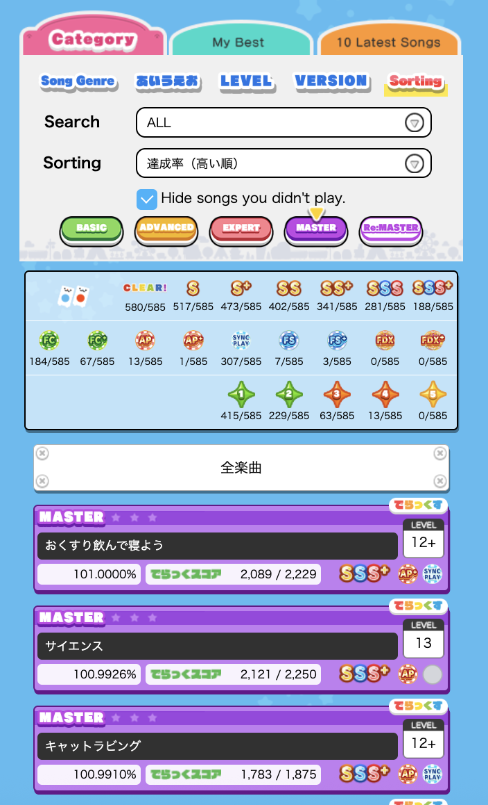

# mai-log

<aside>
💡

> maimaiDX International ver. 사설 전적 관리 서비스
> 
</aside>

- 공식 maimaiDX net 사이트의 불편한 점들을 개선하기 위해 고안된 웹 서비스
- 이 서비스의 영감을 얻은 maishift의 개발자 shiftpsh님에게 존경과 감사의 말씀을 드립니다.

---

## maimaiDX가 무엇인가요?

- maimaiDX는 SEGA에서 개발한 아케이드 리듬게임입니다.
- 일본 오락실에서 자주 볼 수 있으며, 대한민국의 오락실에도 설치되어 있습니다.
- 플레이 기록을 종합하여 자신의 실력을 수치로 보여주는 **‘레이팅’** 시스템이 있습니다.
    - 대부분의 플레이어들은 레이팅을 올리기 위해 최선을 다합니다.

### mai-log를 이해하기 위해 사전에 알아야하는 ‘레이팅’

- maimaiDX는 유저의 악곡 플레이 기록을 점수 산출 공식에 대입 후 그 기록으로 얻을 수 있는 점수를 계산합니다.
- 상세 점수 산출 공식
    - (점수 산출 공식) = 난이도 * 달성률 * 랭크별 계수 / 100 (All Perfect시 1점 추가)
    - 달성률은 최대 100.5까지 적용됩니다. (게임에서 얻을 수 있는 최대 달성률인 101%를 얻어도 100.5로 계산됩니다.)
    - 난이도는 1 ~ 15의 실수로 이루어집니다.
    - 랭크는 달성률에 따라 D ~ SSS+ 까지 부여받습니다.
    - 랭크별 계수가 차이가 크기 때문에 달성률보다는 높은 랭크를 얻는 것이 더 중요합니다.

- 이 점수들 중 **상위 50개의 점수를 합산**한 것이 ‘레이팅’입니다.
    - 50곡 중에서 15곡은 수록된 지 얼마 안된 신곡의 기록만 해당되고, 35곡은 신곡을 제외한 나머지 악곡들이 해당됩니다.

---

## mai-log는 무엇을 개선하나요?

- maimaiDX는 자신의 플레이 기록 및 인게임 관련 내용을 집에서도 접근할 수 있게 하기 위해 maimaiDX net 사이트를 제공하고 있습니다.
    - 하지만 maimaiDX net에서는 자신의 플레이 기록 조회가 불편하고, 자세한 레이팅 정보를 제공하지 않습니다.
    - 게임 수록곡 정보 조회가 불편하여 플레이어가 플레이하고 싶은 악곡을 찾기 번거롭다는 문제가 있습니다.
    - 예시
        - 필터링이 가능한 요소가 적으며, 한번에 한 난이도만 선택해서 볼 수 있어서 불편합니다.
        또한 플레이하지 않은 곡과 플레이한 곡들이 무분별하게 섞여 나옵니다.
        
        
        
        - 레이팅 화면에서 보여주는 정보가 너무 적어 어떤 곡이 어떻게 레이팅에 영향을 미치고 있는지 알기 어렵습니다.
        
        
        

- maimaiDX의 레이팅 산출 방식에 대한 **유저들의 불만**이 많습니다.
    - 예컨대, Full Combo(모든 노트를 놓치지 않음)를 하여도 레이팅에 변화가 없어 의미가 없습니다.
    - All Perfect(모든 노트를 완벽하게 처리함)를 하여도 레이팅 점수는 1점밖에 오르지 않아 달성 난이도에 비해 성취도가 낮습니다.
    - 신곡 15곡, 나머지 35곡으로 나누어진 구성으로 인해 신곡 플레이가 강제되어 불쾌하다는 평가가 있습니다.

> mai-log는 기존의 maimaiDX의 레이팅 산출 방식을 더 합리적이고 실력을 더 잘 반영할 수 있도록 개선하며, 플레이 했던 기록 및 플레이 할 악곡 리스트를 일반적인 유저들도 쉽게 만들 수 있도록 합니다.
> 

---

## 사용 스택(예정)

| 프론트엔드 | 데이터베이스 |
| --- | --- |
| Next.js | PostgreSQL |
| Tailwind CSS |  |
| Prisma ORM |  |

### 백엔드는 어디갔나요?

플레이 기록 조회 및 악곡 리스트 저장 기능에는 백엔드가 필요하지 않고, 레이팅 산출은 프론트엔드에서 처리하는 것이 더 효율적이라고 생각했기 때문에 백엔드를 사용하지 않았습니다.

---

## mai-log가 제공하는 것

mai-log는 다음과 같은 기능을 제공합니다.

### 개선된 레이팅 시스템

- 레이팅 산출 방식을 개편하였습니다.
- 기존 레이팅 산출 방식과 비슷하지만, 산출 공식에 다음과 같은 내용을 추가합니다.
    - (개선된 점수 산출 공식) = 난이도 * 달성률 * 랭크별 계수 * 클리어 마크 계수 / 100
    - 클리어 마크 계수: Full Combo 및 All Perfect 달성 시 추가되는 계수입니다.
    
    | 클리어 마크 | 계수 |
    | --- | --- |
    | Full Combo | 1.005 |
    | Full Combo+ | 1.01 |
    | All Perfect | 1.025 |
    | All Perfect+ | 1.05 |
    - 레이팅 산출 예시
        - 만약 14.0 레벨을 플레이 했을 시
            - SSS+ 기존: 14.0 * 100.5 * 22.4(SSS+ 계수) / 100 = 315점
            - 개선된 산출 공식
                
                SSS+, Full Combo: 14.0 * 100.5 * 22.4 * 1.005 / 100 = 316점 → +1점
                
                SSS+, Full Combo+: 14.0 * 100.5 * 22.4 * 1.01 / 100 = 318점 → +3점
                
                SSS+, All Perfect: 14.0 * 100.5 * 22.4 * 1.025 / 100 = 323점 → +8점
                
                SSS+, All Perfect+: 14.0 * 100.5 * 22.4 * 1.05 / 100 = 330점 → +15점
                
            - SSS 기존: 14.0 * 100.2359 * 21.6(SSS 계수) / 100 = 303점
            - 개선된 산출 공식
                
                SSS, Full Combo: 14.0 * 100.2359 * 22.4 * 1.005 / 100 = 304점 → +1점
                
                SSS, Full Combo+: 14.0 * 100.2359 * 22.4 * 1.01 / 100 = 306점 → +3점
                
- 클리어 마크 계수 추가로 랭크만 중요시되던 기존 레이팅 방식에서 벗어나서, 클리어 마크도 레이팅에 큰 영향을 미치게 되었습니다.
- 신곡 15곡, 나머지 35곡으로 분리되어 있던 구성을 구분없이 50곡으로 통합하였습니다.

### 간편한 플레이 기록 조회

- 자신이 플레이 했던 악곡들의 기록을 쉽게 조회합니다.
- 각종 필터링 기능을 제공합니다.

### 악곡 리스트 저장

- 자신이 추후 하고 싶은 악곡, 다른 사람에게 추천할 악곡을 리스트로 저장하는 기능을 제공합니다.
- 리스트의 이름과 설명을 적어 무엇을 위한 리스트인지 표기합니다.
- 제작한 리스트는 공개 범위를 설정하여 다른 유저들도 열람할 수 있습니다.

### 플레이 데이터 업로드

- maimaiDX는 플레이어의 플레이 기록을 조회하는 API를 따로 제공하지 않습니다.
- 따라서 유저가 직접 maimaiDX net에 접속한 후 북마클릿을 통해 개인의 데이터를 수집하는 방법을 채택하였습니다.
    - 북마클릿(bookmarklet): 북마크 탭에 javascript 구문을 적어 웹사이트에서 임의 코드를 실행하는 것
    - 북마클릿에 직접 mai-log 사이트로 연결 후 maimaiDX net의 DOM 구조를 가져와서 의미있는 데이터를 찾아냅니다.

### 자신의 페이지 공유

- 자신이 저장한 플레이 기록들을 링크를 통해 다른 사람들도 열람 할 수 있습니다.
- ‘갤러리’ 페이지에서 여러 유저들이 공유한 플레이 기록 페이지를 검색하거나 악곡 리스트를 찾을 수도 있습니다.

---

## 유사 서비스

## maishift

- maishift는 mai-log와 유사한 서비스로, 북마클릿 업로드와 플레이 데이터 조회를 지원합니다.
    - maishift는 인게임 내 레이팅을 따라가기 때문에 mai-log와의 레이팅 시스템과는 차이가 있습니다.
    - maishift에서는 악곡 리스트 생성 기능을 제공하지 않습니다.
    - maishift의 심플하고 접근성이 좋은 UI/UX는 많은 배울 점 중 하나입니다.